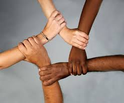

Immigrants and Multicultural Society

AP Social Studies

'How do you identify as an immigrant and what does it mean to live in a multicultural society'

I am a first-generation Canadian citizen of immigrant parents but never really thought of or identified myself that way. My mother emigrated from Poland at a young age with her eight brothers and sisters and landed in Toronto Canada. Bringing as much of her cultural heritage with her as she could, including a sliver menorah, one of a few artifact that they took with them, and eventually raising a family there. I grew up in a culturally diverse downtown Toronto up until half way through the middle of middle school when we then moved to a less diverse north Toronto suburb where I lived till moving out around eighteen. 
In my early thirties I emigrated to New York with my wife and one child, a little less cultural heritage than my mother but included the menorah that my mother gave me. Three of my four children are first generation United states citizens. I still don't identify myself as coming from an immigrant family nor that I am an immigrant from another country, but I do identify with my heritage.

In this course over the next six weeks we will think, discuss and write about immigrants in a multicultural society. Break down the discussions into five topics and define, develop and  present each week.

Week 1 Immigrants and Multiculturalism

  What is Multiculturalism? Let talk about it and define it, how do you experience it  

Week 2 Community

  A community is more than just a group of people living in a particular area
  What does community mean to you? A group of people, family, friends, Neighbors. They are there when we need love support encouragement
	Work independently 
  Readings/references

Week 3 Cultural History

  Cultural history records and interprets past events. What does it mean to you and what is important to bring with you and keep or disregard. 
	Choose a partner
  Readings/references

Week 4 Cultural Heritage

  The use of artifact and rituals from the past to maintain a connection to the present. Do you think it is important to have physical connections to the past?
	Two partners group with another two partners
	Readings/references
  
  Week 5 Cultural Diversity
  
  Cultural diversity is the cultural diversity and cultural differences that exist in the world. In a multicultural society where does the line lie between diversity and monoculture. 
	The group of four form with another group of four
  Readings/references

Week 6 Multicultural Society

  When people of different cultures come together to celebrate and share their cultural differences. What do you think of equal respect and the continuity of cultural diversity.
  This society will present in front of the rest of the class
  Readings/references

What have we learned about diversity and how do we get along. Can we work in harmony and discuss our differences and work on common interests? How much of our culture do we bring to a multicultural society. 
