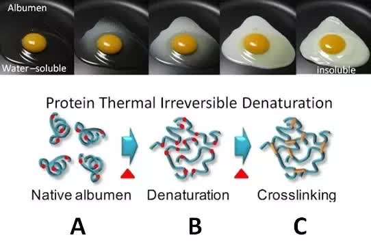

# How to Boil an Egg

Teacher: Oren Shoham
Learner: Zach Coble

## Discussion (5-10 Minutes)

### What happens physically and chemically when you apply heat to an egg?

Heating the egg causes proteins in the egg yolk and egg white to undergo [denaturation](https://en.wikipedia.org/wiki/Denaturation_(biochemistry)#Common_examples), a process in which the chains of amino acids that make up these proteins are broken down and lose their structure.

Denaturation causes the proteins in the egg to become tangled up with each other, which is why boiled eggs transition from a liquid to a solid.

### Why do we remove the pot from heat after the water begins to boil?
Egg yolk sets at a lower temperature (70 degrees C) than egg white (80 degrees C), and boiling applies heat (100 degrees C) from the outside in, so by the time the yolk is set, the white should also have set.

Cooking the egg in boiling water gives a very narrow range of time in which the egg is perfectly cooked.

Overcooking the egg leads to a rubbery egg white and a green discoloration of the egg yolk, caused by a chemical reaction between iron in the yolk and hydrogen sulfide gas from the white, which in turn forms when hydrogen and sulfide in the white react after being heated.

Cooking the egg in the residual heat of water that was brought to boiling gives a wider range of time, because the temperature of the water is falling as the temperature of the egg rises.

### Why place the egg in cold water after it's done?

The cold water quickly stops the egg from cooking.

## Demonstration (10 Minutes)

### Instructions

1. Place uncooked eggs in a pot.
2. Add water until eggs are submerged under the water
3. Bring the pot to a full boil, uncovered
4. Remove pot from heat and cover for 10-12 minutes
5. Drain eggs and submerge in cold water
6. Peel and enjoy!

### Additional Considerations

- Ratio of water to number of eggs
- Peeling techniques
- Older eggs are easier to peel

## Homework

Experiment with different amounts of cooking time. What are the egg yolk and white like after 8 minutes instead of 10? 6? 4?

## Feedback from Zach

- Appreciated the deep dive on the chemistry aspects of cooking, even though a lot of it was too technical to easily communicate. It was interesting to start thinking about eggs from a scientific perspective, it piqued curiosity.
- Liked the overall structure of starting with a discussion and scientific context before actually doing the cooking demonstration.

## References

- https://github.com/tchoi8/teachingasart2018/tree/master/assignments/4_Pedagogy
- https://www.quora.com/Food-Science-Why-do-eggs-turn-from-liquid-to-solid-on-heating
- https://norecipes.com/perfect-boiled-eggs
